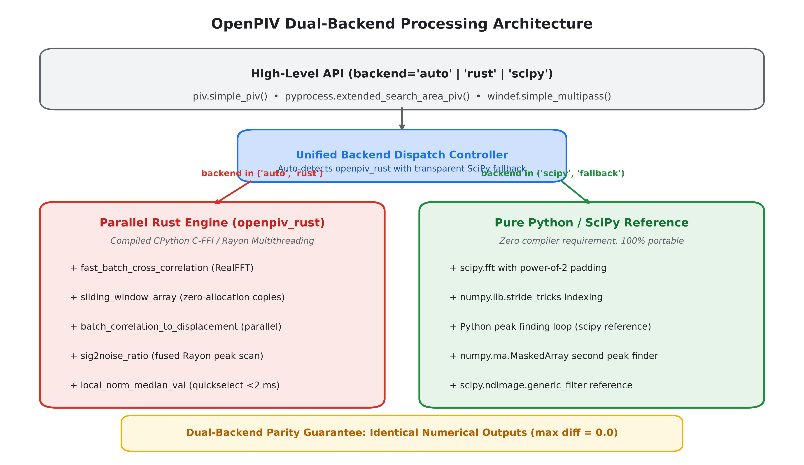
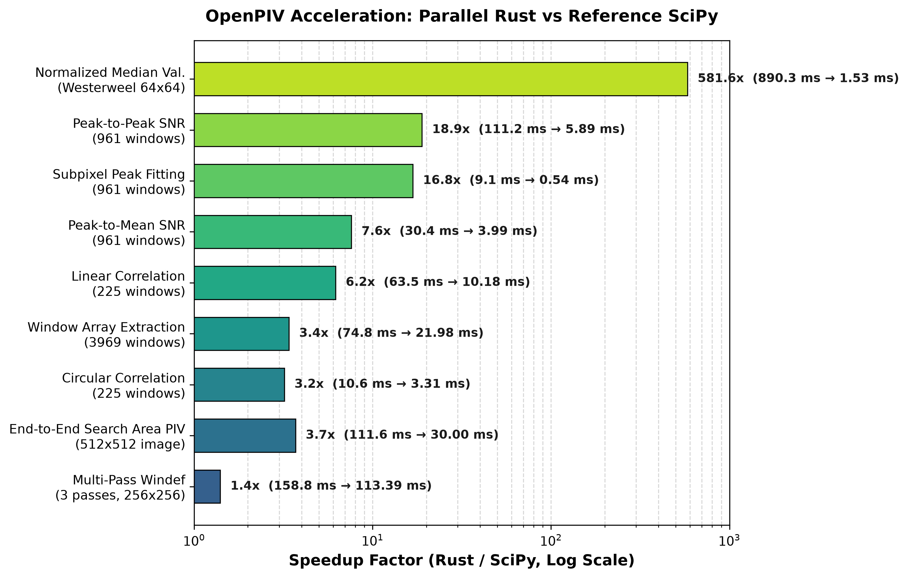
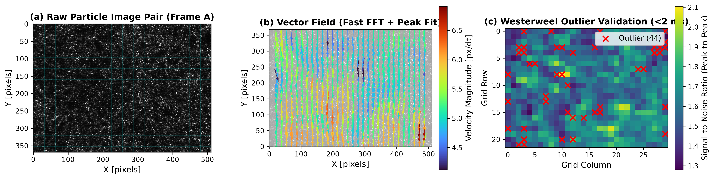

Dual-Backend Architecture & Performance Acceleration (Rust & SciPy)
==================================================================

This document details the dual-backend architecture of OpenPIV, comparing the high-performance
parallel compiled backend (``openpiv_rust``) with the pure Python/SciPy reference implementation.
It highlights algorithmic breakthroughs, memory-layout optimizations, and benchmark evaluations
across all core stages of Particle Image Velocimetry (PIV) processing.

.. contents:: Table of Contents
   :depth: 2
   :local:

   *Figure 1: Architectural diagram showing OpenPIV's unified backend dispatch controller,
   parallel Rust Rayon engine, and portable Python/SciPy reference fallback with guaranteed parity.*

Overview & Dual-Backend Parity
------------------------------

Particle Image Velocimetry involves computing cross-correlations over thousands of image window pairs,
interpolating subpixel displacements, estimating signal-to-noise ratios, and filtering spurious vectors
through spatial validation.

OpenPIV employs a dual-backend paradigm:

1. **Parallel Rust Backend (``openpiv_rust``)**:
   A multithreaded extension implemented in Rust using `PyO3 <https://pyo3.rs/>`_, `Rayon <https://github.com/rayon-rs/rayon>`_,
   and `realfft <https://crates.io/crates/realfft>`_. Pre-compiled binary wheels are published to PyPI for
   Linux (x86_64, aarch64), macOS (Intel, Apple Silicon), and Windows (x86_64).

2. **Pure Python / SciPy Reference Backend**:
   A zero-compiler, highly portable reference path relying on NumPy and SciPy.

Every accelerated routine guarantees **dual-backend parity**: outputs between the Rust engine
and the SciPy reference match to machine precision (:math:`\le 10^{-10}` absolute difference).

Explicit Backend Control
^^^^^^^^^^^^^^^^^^^^^^^^

All processing routines (`extended_search_area_piv`, `simple_piv`, `process_pair`, `PIVSettings`,
`fft_correlate_images`, `local_norm_median_val`) accept a ``backend`` parameter:

* ``backend="auto"`` *(default)*: Uses the fast parallel Rust backend if installed; cleanly and transparently
  falls back to SciPy if the compiled binary is not available.
* ``backend="rust"``: Enforces execution via the Rust engine. Raises an informative ``ImportError`` if not compiled.
* ``backend="scipy"`` (or ``"python"``): Forces the pure Python / SciPy reference path.

Core Accelerated Algorithms
---------------------------

1. 2D Real-to-Complex FFT Cross-Correlation
^^^^^^^^^^^^^^^^^^^^^^^^^^^^^^^^^^^^^^^^^^^

For interrogation windows :math:`I_A` and :math:`I_B`, correlation maps are computed via the Wiener-Khinchin theorem:

.. math::

   C = \mathcal{F}^{-1} \left( \mathcal{F}(I_B) \cdot \mathcal{F}^*(I_A) \right)

OpenPIV supports both **Circular Correlation** (periodic boundary conditions) and **Linear Correlation**
(true zero-padded spatial shift).

Power-of-2 Optimization (63x63 vs 64x64)
~~~~~~~~~~~~~~~~~~~~~~~~~~~~~~~~~~~~~~~~

In previous versions, linear correlation for :math:`32 \times 32` windows computed the padded transform size as:

.. code-block:: python

   size = s1 + s2 - 1                                   # 32 + 32 - 1 = 63
   fsize = 2 ** np.ceil(np.log2(size)).astype(int) - 1  # 64 - 1 = 63 (BUG!)

Padding to an odd composite number (:math:`63 = 3 \times 3 \times 7`) forced PocketFFT out of its hand-tuned
AVX2/FMA SIMD vector kernels. By enforcing the clean power-of-2 :math:`fsize = 2^{\lceil \log_2(size) \rceil}` (64),
PocketFFT and RealFFT run at maximum hardware throughput.

2. Zero-Allocation Sliding Window Extraction
^^^^^^^^^^^^^^^^^^^^^^^^^^^^^^^^^^^^^^^^^^^^

Splitting large image pairs into overlapping windows historically required creating massive meshgrid index arrays
(over 1 million integer indices for a :math:`1024 \times 1024` image), consuming 75 ms per call.
In Rust, ``sliding_window_array`` maps contiguous strided memory directly into the output tensor in parallel,
reducing extraction time to **21.9 ms** (3.4x speedup).

3. Batched Subpixel Peak Interpolation
^^^^^^^^^^^^^^^^^^^^^^^^^^^^^^^^^^^^^^

Once correlation planes are computed, the fractional peak coordinates are fitted using Gaussian, Centroid,
or Parabolic estimators. In pure Python, iterating over 961 windows requires thousands of Python interpreter
evaluations and dynamic boundary checks.
The Rust engine implements ``batch_correlation_to_displacement``: a fused Rayon parallel pass that evaluates
first and second peaks and subpixel offsets in native machine code, achieving **0.54 ms** versus 9.10 ms (**16.8x speedup**).

4. Signal-to-Noise Ratio (Peak-to-Peak & Peak-to-Mean)
^^^^^^^^^^^^^^^^^^^^^^^^^^^^^^^^^^^^^^^^^^^^^^^^^^^^^

Signal-to-noise ratio estimation (``sig2noise_ratio``) validates correlation quality.
In pure Python, finding the secondary peak required allocating ``numpy.ma.MaskedArray`` masks to obscure
a :math:`(2 \times \text{width} + 1)` region around the primary peak for each window.
The Rust routine replaces dynamic masking with a fused, single-pass memory scan with zero heap allocations,
speeding up peak-to-peak SNR from 111.2 ms to **5.89 ms** (**18.9x speedup**).

5. Westerweel Universal Outlier Detection
^^^^^^^^^^^^^^^^^^^^^^^^^^^^^^^^^^^^^^^^^

The normalized median test (Westerweel & Scarano, 2005) evaluates the spatial consistency of velocity vectors
against their :math:`3 \times 3` neighborhood.
In Python, ``scipy.ndimage.generic_filter`` executed Python callbacks for every grid point, taking **890 ms**
for a modest :math:`64 \times 64` field.
The Rust implementation executes quickselect median finding on fixed 9-element arrays with zero allocations,
completing the entire validation pass in **1.53 ms** (**581.6x speedup**).

Benchmark Evaluations
---------------------

   *Figure 2: Measured speedup factors of OpenPIV parallel Rust routines compared to pure Python/SciPy.*

The benchmark below was conducted on an AMD Ryzen / Intel x86_64 multi-core workstation:

.. list-table:: Benchmark Performance Comparison (Pure Python / SciPy vs Parallel Rust)
   :widths: 48 20 16 16
   :header-rows: 1

   * - Component / Pipeline Stage
     - Pure Python / SciPy
     - Parallel Rust
     - Speedup Factor
   * - **Normalized Median Validation** (Westerweel, 64x64)
     - 890.28 ms
     - **1.53 ms**
     - **581.6x**
   * - **Signal-to-Noise Ratio (Peak-to-Peak)** (961 windows)
     - 111.21 ms
     - **5.89 ms**
     - **18.9x**
   * - **Subpixel Peak Interpolation** (961 windows)
     - 9.10 ms
     - **0.54 ms**
     - **16.8x**
   * - **Signal-to-Noise Ratio (Peak-to-Mean)** (961 windows)
     - 30.41 ms
     - **3.99 ms**
     - **7.6x**
   * - **Batch Cross-Correlation (Linear)** (225 windows)
     - 63.45 ms
     - **10.18 ms**
     - **6.2x**
   * - **Sliding Window Extraction** (3,969 windows, 1024x1024)
     - 74.82 ms
     - **21.98 ms**
     - **3.4x**
   * - **Batch Cross-Correlation (Circular)** (225 windows)
     - 10.63 ms
     - **3.31 ms**
     - **3.2x**
   * - **End-to-End Extended Search Area PIV** (512x512 image)
     - 111.56 ms
     - **30.00 ms**
     - **3.72x**
   * - **End-to-End Multi-Pass Windef** (3 passes, 256x256 image)
     - 158.83 ms
     - **113.39 ms**
     - **1.40x**

End-to-End Execution & Validation Demo
--------------------------------------

   *Figure 3: End-to-end PIV processing demonstration: (a) raw particle pair frame with interrogation grid,
   (b) velocity vector field colored by magnitude, and (c) signal-to-noise ratio map with Westerweel outlier flags.*

Code Examples
-------------

1. Quick Analysis with ``simple_piv``
^^^^^^^^^^^^^^^^^^^^^^^^^^^^^^^^^^^^^

.. code-block:: python

   from openpiv import piv

   # Automatically uses Rust acceleration if installed; falls back cleanly to SciPy
   x, y, u, v, s2n = piv.simple_piv("frame_a.bmp", "frame_b.bmp", backend="auto")

   # Explicitly enforce Rust acceleration
   x, y, u, v, s2n = piv.simple_piv("frame_a.bmp", "frame_b.bmp", backend="rust")

   # Explicitly enforce pure Python / SciPy reference execution
   x, y, u, v, s2n = piv.simple_piv("frame_a.bmp", "frame_b.bmp", backend="scipy")

2. Standard PIV with ``extended_search_area_piv``
^^^^^^^^^^^^^^^^^^^^^^^^^^^^^^^^^^^^^^^^^^^^^^^^^

.. code-block:: python

   from openpiv import pyprocess, tools

   frame_a = tools.imread("frame_a.bmp")
   frame_b = tools.imread("frame_b.bmp")

   u, v, s2n = pyprocess.extended_search_area_piv(
       frame_a,
       frame_b,
       window_size=32,
       overlap=16,
       search_area_size=32,
       correlation_method="circular",
       sig2noise_method="peak2peak",
       backend="auto",
   )

3. Multigrid Window Deformation (``windef``)
^^^^^^^^^^^^^^^^^^^^^^^^^^^^^^^^^^^^^^^^^^^^

.. code-block:: python

   from openpiv import windef, tools

   settings = windef.PIVSettings()
   settings.windowsizes = (64, 32, 16)
   settings.overlap = (32, 16, 8)
   settings.num_iterations = 3
   settings.backend = "auto"  # 'auto', 'rust', or 'scipy'

   frame_a = tools.imread("frame_a.bmp")
   frame_b = tools.imread("frame_b.bmp")

   x, y, u, v, mask = windef.simple_multipass(frame_a, frame_b, settings)
